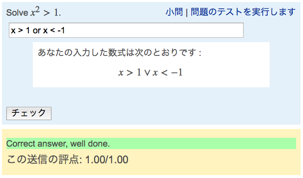
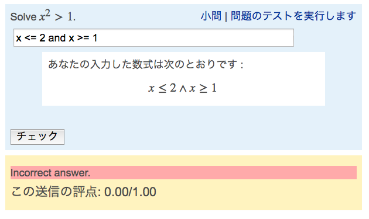
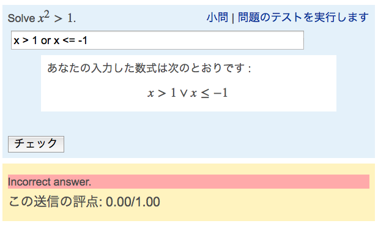

# afuns
Adhoc functions for STACK.

These are little functions written in Maxima useful for teachers using [STACK](https://github.com/maths/moodle-qtype_stack/blob/master/doc/en/About/index.md), 
an open-source system for computer-aided assessment in Mathematics on [Moodle](https://docs.moodle.org/28/en/About_Moodle).

## is_same_interval

